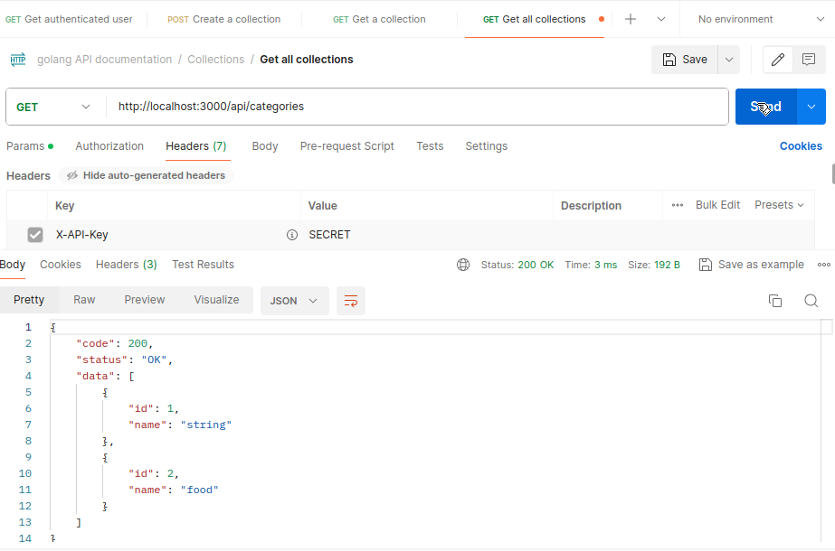
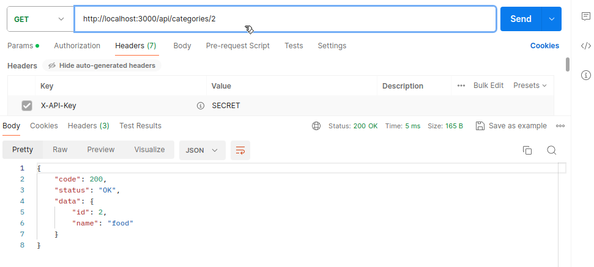
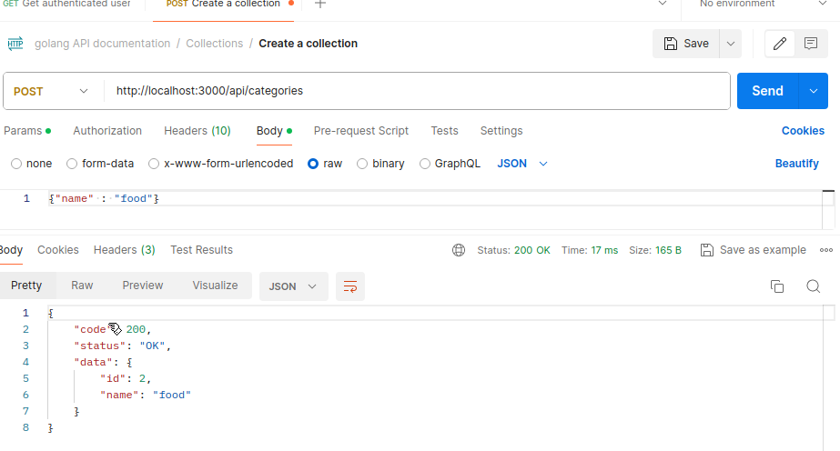
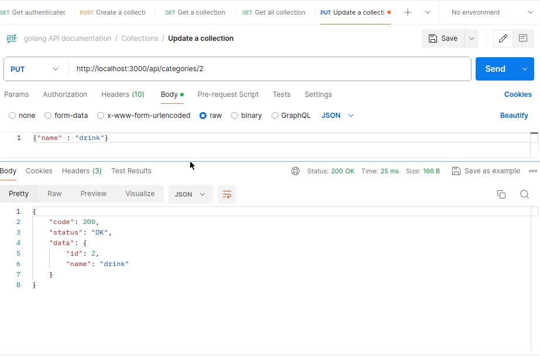
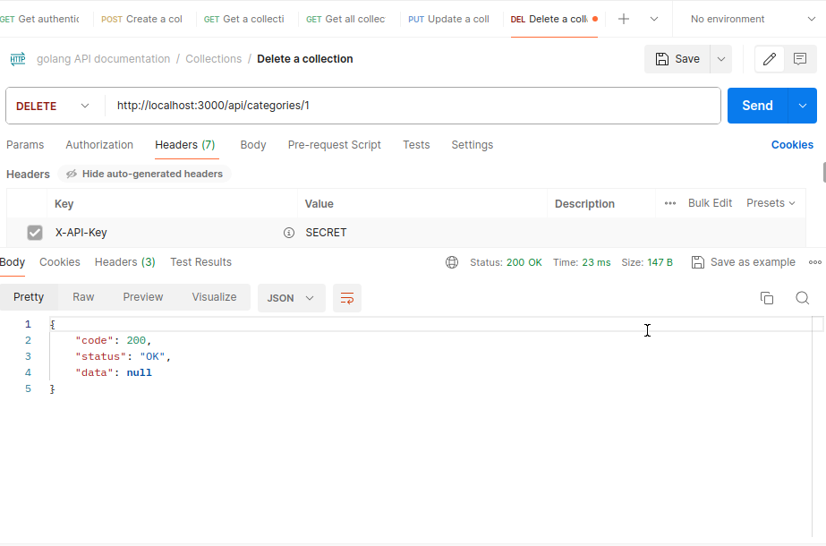
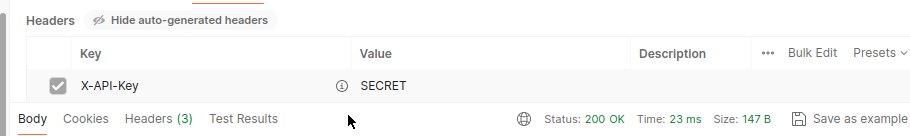

# Golang CRUD RESTful API

Golang CRUD RESTful API is a simple RESTful API using Golang as the programming language and MySQL as the database. This API is used to manage categories.

## 🚀 Fitur

- CRUD operations for categories
- Input validation using `go-playground/validator`
- Authentication middleware
- Auto-generated Swagger documentation
- Modular clean architecture design
- MySQL database integration

## Development

### Prerequisites

* Go 1.22 or higher
* MySQL 8.0 or higher

### Running the application

1. Run the following command to start the application:
	
	go run main.go

## Endpoints

### GET /categories

Get all categories.

#### Response

* 200 OK
	+ Body: array of category objects

### GET /categories/:categoryId

Get category by id.

#### Parameters

* categoryId: category id

#### Response

* 200 OK
	+ Body: category object
* 404 Not Found
	+ Body: error message

### POST /categories

Create new category.

#### Request Body

* name: category name

#### Response

* 201 Created
	+ Body: category object
* 400 Bad Request
	+ Body: error message

### PUT /categories/:categoryId

Update category by id.

#### Parameters

* categoryId: category id

#### Request Body

* name: category name

#### Response

* 200 OK
	+ Body: category object
* 404 Not Found
	+ Body: error message
* 400 Bad Request
	+ Body: error message

### DELETE /categories/:categoryId

Delete category by id.

#### Parameters

* categoryId: category id

#### Response

* 200 OK
	+ Body: success message
* 404 Not Found
	+ Body: error message

## Security

This API uses API key as the authentication mechanism. The API key should be sent in the request header with key `X-API-Key`.

